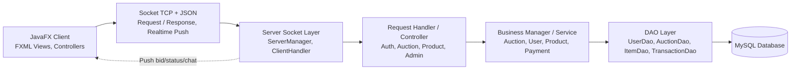

# Online Auction System

> Bài tập lớn Lập trình nâng cao 2026 - Hệ thống đấu giá trực tuyến theo mô hình Client/Server.

Online Auction System là ứng dụng đấu giá trực tuyến xây dựng bằng Java 21 và JavaFX. Hệ thống mô phỏng một sàn đấu giá có đủ các luồng nghiệp vụ chính: người bán đăng sản phẩm và tạo phiên đấu giá, quản trị viên kiểm duyệt và quản lý hệ thống, người mua tham gia đặt giá theo thời gian thực, thanh toán phiên thắng và nhận thông báo.

## Tài Liệu Nộp Bài

| Nội dung | Link |
|---|---|
| Báo cáo PDF và video demo | [Google Drive](https://drive.google.com/drive/folders/1gD5xDIo2LHQo_NbtDFnH7xI1rS9u6G-w?usp=sharing) |
| Bản phát hành JAR | [GitHub Release v2.0.0](https://github.com/Team-09-LTNC/Online-auction-system/releases/tag/v2.0.0) |

## 1. Mô Tả Bài Toán Và Phạm Vi Hệ Thống

### Bài toán

Bài toán đặt ra là xây dựng một hệ thống đấu giá trực tuyến cho phép nhiều người dùng tham gia các phiên đấu giá sản phẩm. Hệ thống cần quản lý người dùng theo vai trò, đảm bảo cập nhật giá đấu realtime giữa các client, xử lý thanh toán sau khi kết thúc phiên và hỗ trợ quản trị viên theo dõi, kiểm duyệt, quản lý dữ liệu trong toàn hệ thống.

### Phạm vi hệ thống

| Vai trò | Chức năng chính |
|---|---|
| `ADMIN` | Quản lý dashboard, tài khoản bidder/seller, duyệt phiên đấu giá, quản lý giao dịch và hóa đơn. |
| `SELLER` | Đăng sản phẩm, tạo phiên đấu giá, chỉnh sửa/xóa sản phẩm và theo dõi trạng thái sản phẩm của mình. |
| `BIDDER` | Xem danh sách phiên đấu giá, theo dõi phiên, đặt giá, auto-bid, mua ngay, thanh toán và nhận thông báo. |

### Kiến trúc tổng quát



Server là thành phần duy nhất truy cập cơ sở dữ liệu. Client chỉ giao tiếp với server thông qua socket TCP và dữ liệu JSON.

## 2. Công Nghệ Sử Dụng, Môi Trường Chạy Và Yêu Cầu Cài Đặt

### Công nghệ sử dụng

| Nhóm | Công nghệ |
|---|---|
| Ngôn ngữ | Java 21 |
| Giao diện | JavaFX 21, FXML, CSS |
| Build tool | Maven |
| Giao tiếp mạng | Java Socket TCP, JSON |
| Xử lý JSON | Gson |
| Database | MySQL, HikariCP connection pool |
| Kiểm thử | JUnit 5, AssertJ, H2 Database |
| Logging | SLF4J, Logback |
| Đóng gói | Maven Shade Plugin, executable JAR |

### Môi trường chạy

- Hệ điều hành: Windows, Linux hoặc macOS.
- Java runtime: JDK/JRE 21 hoặc mới hơn.
- Database: MySQL 8 hoặc database MySQL tương thích.
- Client chạy trên máy có môi trường desktop để mở giao diện JavaFX.

### Yêu cầu cài đặt

- Cài JDK 21 để chạy các file JAR trong GitHub Release.
- Cài Maven 3.9 hoặc mới hơn nếu muốn build lại project từ mã nguồn.
- Cấu hình MySQL hoặc dùng database đã được cấu hình sẵn trong `src/main/resources/application.properties`.
- Đảm bảo port `8080` trên máy chạy server chưa bị chương trình khác sử dụng.

Kiểm tra Java bằng lệnh sau. Lệnh này dùng được trên Windows PowerShell, Linux Bash và macOS Terminal:

```bash
java -version
```

Kết quả mong muốn khi chạy bản Release: `java -version` hiển thị Java 21 hoặc cao hơn.

Nếu muốn build project từ source, kiểm tra thêm Maven:

```bash
mvn -version
```

## 3. Cấu Trúc Thư Mục Toàn Dự Án Và Các Module Chính

```text
.
├── .github/                         # Cấu hình GitHub nếu có
├── .idea/                           # Cấu hình IDE IntelliJ IDEA
├── .vscode/                         # Cấu hình Visual Studio Code
├── logs/                            # Log sinh ra khi chạy ứng dụng
├── src/
│   ├── main/
│   │   ├── java/com/auction/
│   │   │   ├── client/              # JavaFX client, controller, socket client, cache UI
│   │   │   ├── common/              # DTO, enum, model, exception, util dùng chung
│   │   │   └── server/              # Socket server, handler, manager nghiệp vụ, DAO, database
│   │   └── resources/
│   │       ├── application.properties
│   │       ├── logback.xml
│   │       ├── css/                 # Style giao diện
│   │       ├── fxml/                # Layout JavaFX
│   │       └── images/              # Ảnh/icon dùng trong ứng dụng
│   └── test/
│       ├── java/com/auction/        # Unit test và integration test
│       └── resources/               # Cấu hình H2 cho test
├── target/                          # Thư mục sinh ra sau khi build
├── .gitignore
├── pom.xml                          # Cấu hình Maven, dependency, build plugin
└── README.md
```

### Module chính

| Module | Vai trò |
|---|---|
| `client` | Chứa ứng dụng JavaFX, controller màn hình, xử lý sự kiện UI, socket client, push handler và cache giao diện. |
| `common` | Chứa DTO, enum, model, exception và tiện ích dùng chung cho cả client và server. |
| `server` | Chứa socket server, request dispatcher, handler, manager/service nghiệp vụ, DAO và cấu hình database. |
| `resources/fxml` | Chứa layout FXML cho các màn hình đăng nhập, bidder, seller, admin và component dùng chung. |
| `resources/css` | Chứa stylesheet cho giao diện JavaFX. |
| `test` | Chứa test cho model, util, mapper, controller helper, server handler, manager và DAO integration. |

### Entry point

| Thành phần | Class | Nhiệm vụ |
|---|---|---|
| Server | `com.auction.server.ServerApp` | Khởi động socket server, lắng nghe client và xử lý request. |
| Client | `com.auction.client.MainApp` | Khởi động ứng dụng JavaFX. |

## 4. Cấu Hình Ứng Dụng

File cấu hình mặc định:

```text
src/main/resources/application.properties
```

Ví dụ cấu hình database và network:

```properties
db.host=localhost
db.port=3306
db.name=auction_db
db.user=root
db.password=your_password
db.ssl=false

server.ip=127.0.0.1
server.port=8080
```

Khi chạy server và client trên cùng một máy, giữ `server.ip=127.0.0.1` và `server.port=8080`.

Nếu muốn dùng file cấu hình database riêng, tạo file `application-local.properties`, sau đó chạy server với:

```bash
java -Ddb.config.file=application-local.properties -jar ServerApp.jar
```

Nếu chạy từ file tự build trong thư mục `target/`, thay `ServerApp.jar` bằng `target/ServerApp.jar`.

## 5. Tải Và Chạy Chương Trình Trên Cùng Một Máy

Project có sẵn file JAR trong GitHub Release. Đây là cách chạy khuyến nghị khi chấm bài vì không cần build lại mã nguồn. Quy trình dưới đây áp dụng cho Windows, Linux và macOS khi server và client chạy trên cùng một máy.

### Bước 1: Tải bản phát hành phù hợp

Truy cập:

```text
https://github.com/Team-09-LTNC/Online-auction-system/releases/tag/v2.0.0
```

Tải các file phù hợp:

| File | Dùng cho |
|---|---|
| [ServerApp.jar](https://github.com/Team-09-LTNC/Online-auction-system/releases/download/v2.0.0/ServerApp.jar) | Máy chạy server |
| [MainApp-Windows.jar](https://github.com/Team-09-LTNC/Online-auction-system/releases/download/v2.0.0/MainApp-Windows.jar) | Client trên Windows |
| [MainApp-Linux.jar](https://github.com/Team-09-LTNC/Online-auction-system/releases/download/v2.0.0/MainApp-Linux.jar) | Client trên Linux |
| [MainApp-macOS.jar](https://github.com/Team-09-LTNC/Online-auction-system/releases/download/v2.0.0/MainApp-macOS.jar) | Client trên macOS |

Đặt `ServerApp.jar` và file client đã tải vào cùng một thư mục để dễ chạy lệnh. Ví dụ trên Windows:

```text
ServerApp.jar
MainApp-Windows.jar
```

Trên Linux hoặc macOS, file client sẽ lần lượt là `MainApp-Linux.jar` hoặc `MainApp-macOS.jar`.

### Bước 2: Chạy server

Mở terminal thứ nhất tại thư mục chứa JAR và chạy:

```bash
java -jar ServerApp.jar
```

Server mặc định lắng nghe tại:

```text
127.0.0.1:8080
```

### Bước 3: Chạy client

Giữ terminal server đang chạy. Mở terminal thứ hai tại thư mục chứa JAR.

Windows:

```bash
java -jar MainApp-Windows.jar
```

Linux:

```bash
java -jar MainApp-Linux.jar
```

macOS:

```bash
java -jar MainApp-macOS.jar
```

Client sẽ tự kết nối tới server tại `127.0.0.1:8080`.

### Bước 4: Đăng nhập và kiểm tra chức năng

Có thể dùng các tài khoản mẫu sau để kiểm tra nhanh các vai trò trong hệ thống:

| Vai trò | Username | Password |
|---|---|---|
| Admin | `admin` | `admin` |
| Seller | `seller1` | `123456` |
| Bidder | `bidder1` | `123456` |
| Bidder | `bidder2` | `123456` |

## 6. Danh Sách Chức Năng Đã Hoàn Thành

### Xác thực và phân quyền

- Đăng ký tài khoản bidder/seller.
- Đăng nhập và điều hướng giao diện theo vai trò.
- Lưu thông tin phiên đăng nhập phía client.
- Kiểm tra trạng thái tài khoản khi đăng nhập, bao gồm tài khoản bị khóa tạm thời hoặc vĩnh viễn.

### Chức năng cho Bidder

- Xem danh sách phiên đấu giá.
- Tìm kiếm và lọc phiên đấu giá.
- Xem chi tiết phiên, ảnh sản phẩm, giá hiện tại và thời gian còn lại.
- Theo dõi và hủy theo dõi phiên đấu giá.
- Tham gia phòng đấu giá realtime.
- Đặt giá thủ công.
- Cấu hình auto-bid với giá tối đa và bước nhảy.
- Mua ngay nếu phiên có giá mua ngay.
- Xem lịch sử đặt giá và biểu đồ diễn biến giá.
- Quản lý ví, nạp/rút tiền và xem lịch sử giao dịch.
- Thanh toán phiên thắng và nhận thông báo hệ thống.

### Chức năng cho Seller

- Đăng sản phẩm mới.
- Nhập thông tin sản phẩm, ảnh, giá khởi điểm, bước giá, thời gian bắt đầu/kết thúc.
- Tạo phiên đấu giá gắn với sản phẩm.
- Xem danh sách sản phẩm/phiên của mình.
- Cập nhật thông tin sản phẩm và phiên đấu giá khi hợp lệ.
- Xóa sản phẩm/phiên thuộc quyền sở hữu.
- Theo dõi trạng thái duyệt và trạng thái đấu giá.

### Chức năng cho Admin

- Xem dashboard tổng quan.
- Quản lý danh sách bidder và seller.
- Khóa/mở tài khoản người dùng.
- Duyệt hoặc từ chối phiên đấu giá chờ kiểm duyệt.
- Quản lý phiên đấu giá.
- Theo dõi giao dịch và hóa đơn.
- Xem doanh thu và các thống kê phục vụ quản trị.

### Đấu giá realtime và thanh toán

- Server push sự kiện realtime khi có bid mới, thay đổi trạng thái phiên hoặc thông báo mới.
- Tự động cập nhật trạng thái phiên theo thời gian.
- Hỗ trợ auto-bid cạnh tranh giữa nhiều bidder.
- Xử lý mua ngay và kết thúc phiên.
- Xử lý thanh toán cho người thắng phiên.
- Ghi nhận giao dịch ví và hóa đơn.
- Xử lý hủy/quá hạn thanh toán.
- Áp dụng phí phạt 10% và khóa tài khoản theo số lần vi phạm.

### Kỹ thuật và kiểm thử

- Tách lớp rõ ràng: UI, network, handler, manager/service, DAO, model.
- DTO và enum dùng chung giúp chuẩn hóa giao thức request/response.
- Connection pool bằng HikariCP.
- Logging bằng Logback.
- Cache ảnh và cache view để giảm tải khi dùng client.
- Bộ test bao phủ model, util, mapper, controller helper, handler, manager và DAO integration bằng H2.

## 7. Lưu Ý Khi Chạy

- Luôn chạy server trước client.
- Server và client trong README này được hướng dẫn chạy trên cùng một máy, dùng địa chỉ mặc định `127.0.0.1:8080`.
- Nếu port `8080` đang bị chiếm, cần đổi `server.port` trong file cấu hình hoặc truyền `--server-port` khi chạy server.
- Nếu đổi database, cần cập nhật lại file cấu hình tương ứng trước khi chạy server.
